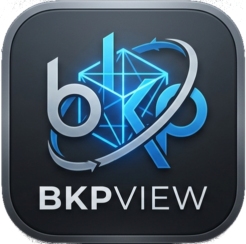
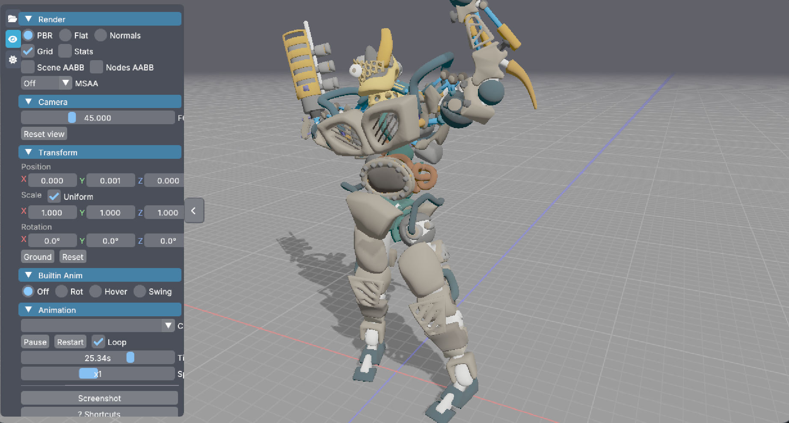
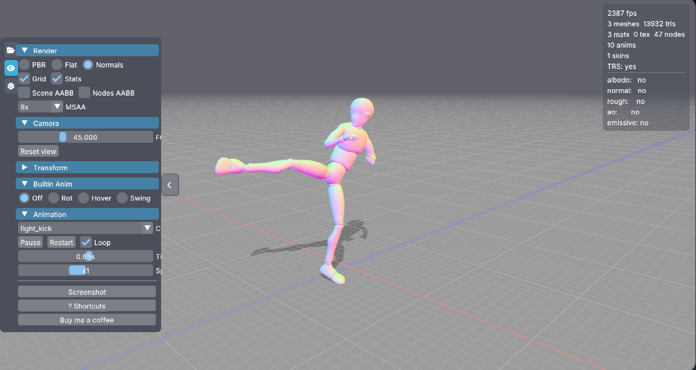
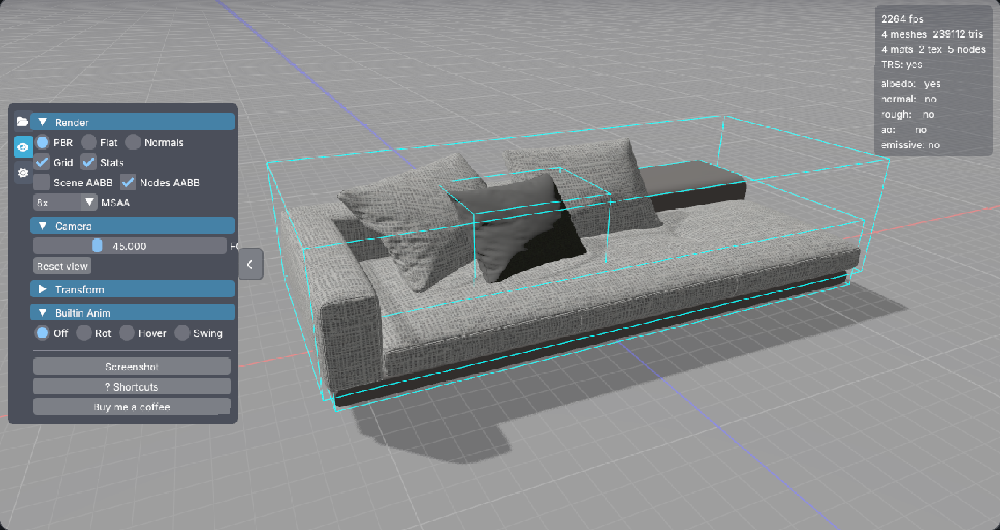

<p align="center">
  
</p>

<h1 align="center">BkpView</h1>
<p align="center">Fast, lightweight 3D model viewer — check your assets before shipping or printing.</p>

---



BkpView is a no-frills Vulkan-based 3D viewer for game developers and makers. Drop a file, inspect it, move on. Built on [blukpast](https://github.com/wypifu/blukpast), a lightweight C library for Vulkan.

---

## Screenshots

| Normals + skeletal animation | PBR + textures + node AABB |
|:---:|:---:|
|  |  |

---

## Features

- PBR, Flat, and Normals render modes
- Skeletal animation playback (glTF)
- Built-in turntable, hover and swing animations
- Shadow and ground plane
- Scene/node bounding boxes (AABB)
- Transform controls (position, rotation, scale)
- Light direction, elevation and intensity
- MSAA up to 8x
- Stats overlay (fps, tris, meshes, textures)
- Recent files list
- Screenshot export (PNG, saved next to the source file)
- Drag & drop or file dialog

## Supported formats

| Format | Extension |
|--------|-----------|
| glTF 2.0 | `.gltf` `.glb` |
| Wavefront OBJ | `.obj` |
| Stanford PLY | `.ply` |
| STL | `.stl` |

## Keyboard shortcuts

| Key | Action |
|-----|--------|
| `P` | PBR mode |
| `F` | Flat mode |
| `N` | Normals mode |
| `G` | Toggle grid |
| `Space` | Play / Pause animation |
| `R` | Reset camera |

---

## Building

### Requirements

- CMake 3.10+
- Vulkan SDK
- GLFW 3

**Linux:** install `vulkan-devel` (or equivalent) and `libglfw3-dev` from your package manager.

**Windows:** set the `GLFW` environment variable to your GLFW SDK root (e.g. `C:\glfw-3.4.WIN64`) and make sure `VULKAN_SDK` is set by the Vulkan SDK installer.

### 1 — Build blukpast

```bash
git clone https://github.com/wypifu/blukpast
cd blukpast
mkdir build && cd build
cmake .. -DCMAKE_BUILD_TYPE=Release
make -j$(nproc)
```

### 2 — Build BkpView

```bash
git clone https://github.com/wypifu/bkpview
cd bkpview
mkdir build && cd build
cmake .. -DCMAKE_BUILD_TYPE=Release -DBKP_ROOT=../../blukpast
make -j$(nproc)
```

> If `blukpast` and `bkpview` share the same parent directory, `-DBKP_ROOT` can be omitted — CMake will find it automatically.

---

## License

BkpView is released under the **MIT License**.
It depends on [blukpast](https://github.com/wypifu/blukpast), released under the **LGPL v2.1**.
See [thirdparty/imgui](thirdparty/imgui) for ImGui license.
